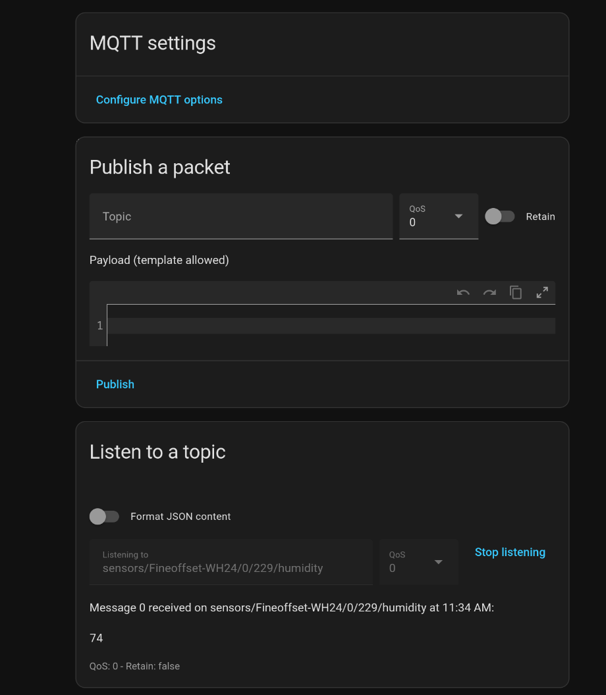
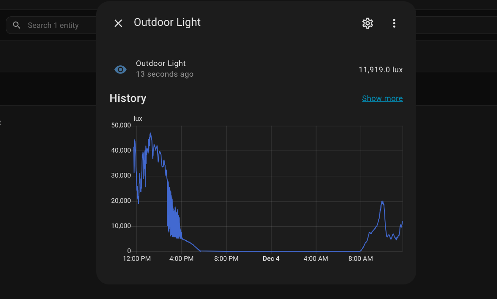
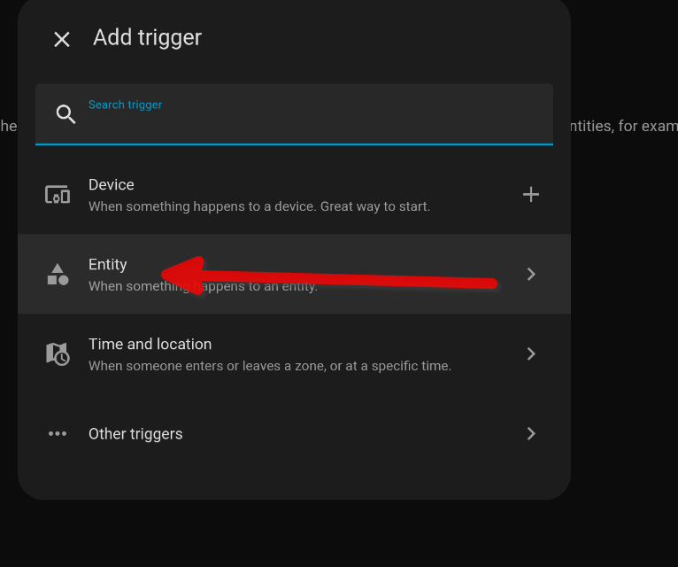
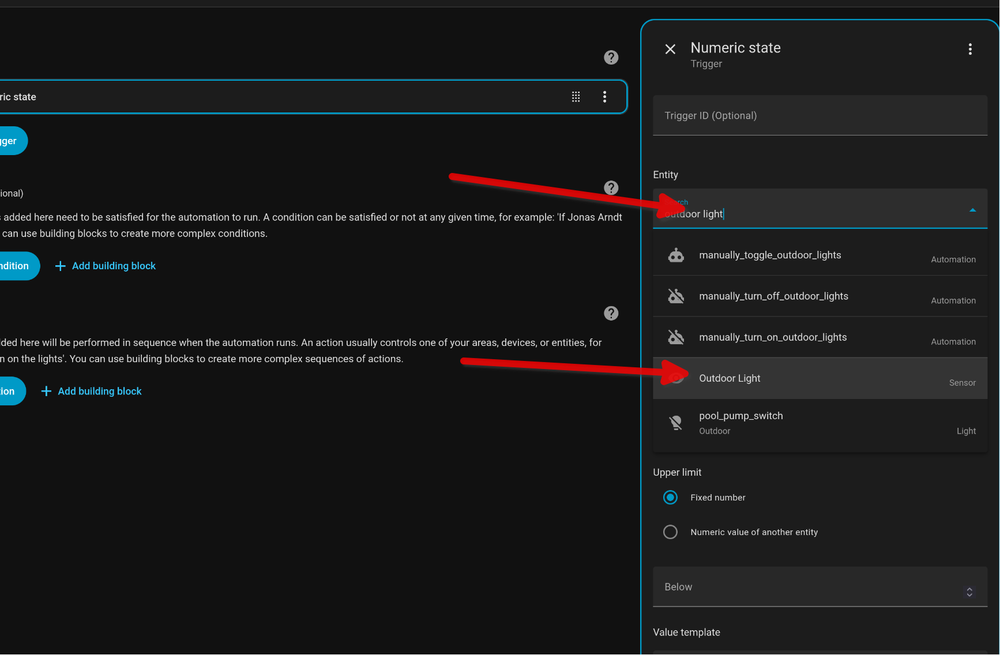
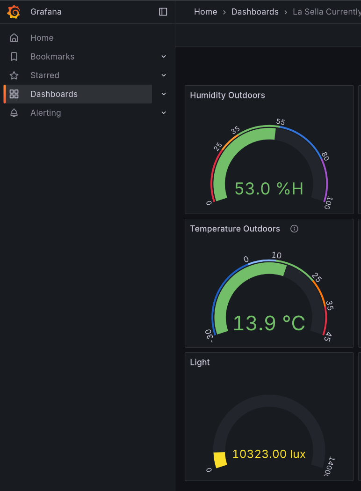
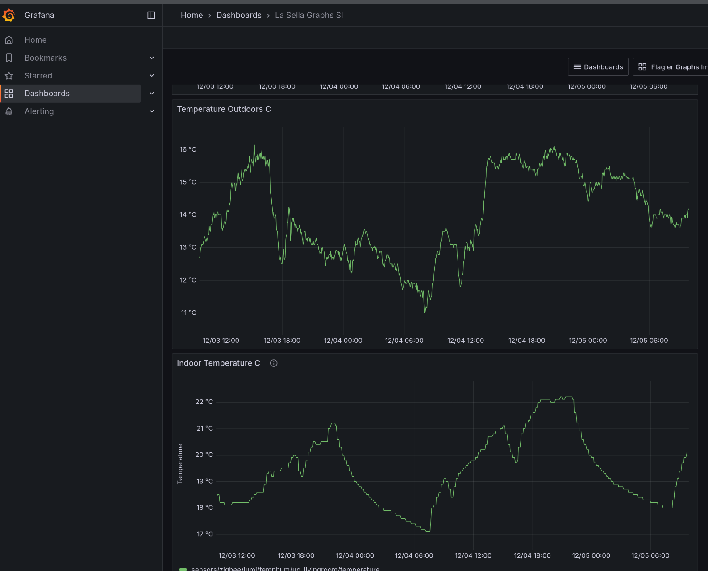

# Weatherhass
## Introduction
This project came about as part of the SUSE [Hack Week](https://hackweek.opensuse.org/)  
I am currently not addressing the MQTT server. You can also set that up as a
container but there are many ways of getting an MQTT server up and running,
including just installing one in Home Assistant. 

## Project Definition
Integration of Home Assistant with weather stations using radio to emit weather
data on 433.92 MHz. While some potential automation examples that can come out
of this are highlighted, this project will not actually deal with those examples
but rather with the integration between the weather station and Home Assistant.
The idea is to use a radio USB dongle (RTL2832), the rtl-433 software, and an
MQTT bus to facilitate the introduction of the metrics into Home Assistant. Home
Assistant already has integration for consuming metrics off an MQTT bus.  
We also want everything to run in containers independent of the host OS. This is
specifically challenging as we are dealing with hardware (RTL2832) that is
attached on the host via a USB port. The solution needs to work even if you move
the USB dongle around.

I also defined a stretch goal to the project. As we have weather metrics
floating around on an MQTT bus, why not also stick them in an InfluxDB so that
we can use something like Grafana dashboard to get historical weather data

## Assumptions
As I only had a couple of days to do this I didn't have time to script the whole
installation. The files that are in this project have some assumptions in them.
It would be necessary to make change to them to fit other environments and
setups that I had during this project. Here are some stuff that needs to be
changed:  
* Containers/rtl_433/runme.sh - update with MQTT server's hostname/IP, port, and
  the needed credentials. You can also make changes to your topics here but what
  is there now is working in Home Assistant
* Containers/rtl_433/rtl_433.conf - This one I have pretty much left alone and
  just used the one provided by the package maintainer in Debian. It works. If you
  understand the parameters feel free to change
* Containers/rtl_433/Dockerfile - This one should be changed to latest Debian. I
  had previous experience with rtl-433 on Bullseye, so that is why I left it
  like that. I intend to test with Trixie too
* Containers/rtl_433/docker-compose-rtl433.yml - Here I have made assumptions on
  where podman ends up, as well as volumes. Please adjust to your environment.
  Note the devices section. This one is important as we are passing an environment
  variable to the container this way. This environment variable is the host device
  of the RTL2832
* udev-rules/10-rtl-sdr.rules - Leave as is unless you know what you are doing
* Services/docker-rtl433@.service - Assumptions on where podman-compose is, and
  what service WorkingDirectory you will be using. Can all be changed. Also, as
  for any service file, dependencies can be a bit dependent on what distro you
  are running

## How it all fits together
The idea here is that the following happens at either system start up or when
the RTL2832 is introduced to the system:
* The udev rule 10-rtl-sdr.rule matches the device, creates a symlink
  /dev/RTL2832U. Note that this symlink cannot be passed into a container, but it
  is used by the service file (at least that is my understanding). 
* The udev subsystem creates and starts the service
  docker-rtl433@-dev-bus-usb-$env{BUSNUM}-$env{DEVNUM}.service (e.g.
  docker-rtl433@-dev-bus-usb-001-002.service). Note that the service has a BindsTo
  parameter that is used to identify the udev device and that the real device path
  is in the "%I" variable, which is part of the ExecStart call
* That service is using podman-compose and a compose file to (if needed) build
  the container, then start it. It will pass in the real device to the container.

## Installation
To start with it is a good idea to build the container, and try to run it
stand-alone without the udev and service integration. Just to make sure it
works. You will need to figure out where your USB dongle is hanging out, eg: 
```bash
$ lsusb | grep RTL2838
```
Once you have your container work in a stand-alone mode, you need to edit all
the files to match your environment (see Assumptions). Then:
* Copy the service file to /etc/systemd/system
* Create the directory for your container (e.g.
/usr/local/Podman/DockerCompose/rtl_433/) and copy over rtl_433.conf, runme.sh,
Dockerfile, and docker-compose-rtl433.yml there.
* Copy over 10-rtl-sdr.rules to /etc/udev/rules.d/
* Reboot your server or reload udev and systemd

## Troubleshooting
To be added

## Output
If you have mosquitto tools (mosquitto-clients) installed you can run
mosquitto_sub and test that you are receiving your weather data:

```bash
jonas@suselaptop:~$ mosquitto_sub -h 192.168.2.100 --username <user> -P <password> -v -t sensors/#
sensors/Fineoffset-WH24/0/229/time 2025-12-03 08:39:09.502401
sensors/Fineoffset-WH24/0/229/protocol 78
sensors/Fineoffset-WH24/0/229/id 229
sensors/Fineoffset-WH24/0/229/battery_ok 1
sensors/Fineoffset-WH24/0/229/temperature_F 53.42
sensors/Fineoffset-WH24/0/229/humidity 58
sensors/Fineoffset-WH24/0/229/wind_dir_deg 285
sensors/Fineoffset-WH24/0/229/wind_avg_m_s 1.4
sensors/Fineoffset-WH24/0/229/wind_max_m_s 2.24
sensors/Fineoffset-WH24/0/229/rain_in 73.34631
sensors/Fineoffset-WH24/0/229/uv 62
sensors/Fineoffset-WH24/0/229/uvi 0
sensors/Fineoffset-WH24/0/229/light_lux 7858.0
sensors/Fineoffset-WH24/0/229/mic CRC
```

## Setup in Home Assistant
The first thing you need to do in Home Assistant is to add the "MQTT"
integration. In there you will fill in information about your MQTT server. Once
that is done you can test listen to a topic. In the Settings->Integration->MQTT
section you can click the wheel and you will see the following window:  
   
In the "Listen to a topic" section you can put in a topic and test listen for it
by selecting "Start listening". In my case I put in
sensors/Fineoffset-WH24/0/229/humidity and what came back after a while was 74,
which is percentage humidity.  

Okay, so time to make some of our weather related metrics (or all of them)
availabel as sensors in Home Assistant. You do that by loging into your Home
Assistant instance and editing config/configuration.yaml. Go to the end of the
file and add an entry for each metric you are interested in. Here is an example
that exposes the light_lux metric.  
```bash
...
mqtt:
  sensor:
    - name: "Outdoor Light"
      state_topic: "sensors/Fineoffset-WH24/0/229/light_lux"
      unit_of_measurement: "lux"
...
```
After this you need to reload Home Assistant.  

You can now go to Settings->Device & Services->Entities. In the above sensor
configuration we picked a name "Outdoor Light" and it should appear in the
Entities list. If you click on it some graph will show up, like:
 

You can now use this entity/sensor in automations. You will need to "Add
trigger" that is of the type "Entity" and then pick "Numeric state" and search
for "Outdoor Light" as the entity. 
   
   
You can then decide if you want the
automation to take action if it goes over or under a certain value, and for how
long. For instance, you might not want to retract your outdoor awning just
because the sun went behind a cloud for 2 minutes...

## InfluxDB
This is a more straight forward containerized solution as there is no hardware
to worry about. I did here pick the latest InfluxDB2 version (2.7). We will be
using "Telegraf" to listen to the MQTT topics and insert events into InfluxDB
and Telegraf works well with 2.x version of InfluxDB. It might work with 3.x
too, but I have no experience with that. 

## Installation
The files are in the influxdb directory:  
**docker-compose-influxdb.yml**  
You need to edit every thing that is surrounded by '<>'. Notably there are a
bunch of environment variables for the influxdb container. You will also need to
decide on your host's directory structure and edit the volumes section
accordingly. This is also true for the telegraf container.  

**config.yaml**  
Can be left like it is

**influx-configs**  
Update org to reflect your organization

**telegraf.conf**  
This is also full of '<>' that you need to address. Note that in my case I run
the MQTT server also as a container on the same host, so I can use the insecure
port of the MQTT server and don't have to worry about ssl certificates. Telegraf
can handle that too, but I have not played with that for this project.  
Under input.mqtt_consumer.topics I have listed all topics my weather station
emits. You will need to adjust this to fit your weather station. Also note that
the original telegraf.conf file that is part of any distribution typically has
all options in the file with descriptions, but all commented out. This is a
great goto file for documentation.  

The services file, docker-influxdb.service, is placed in /etc/systemd/system
folder after it has been edited to reflect your environment. Then a systemctl
daemon-reload before you can start the service.

## Troubleshooting
Do podman logs on your influxdb instance to make sure it is coming up okay. Then
there is the telegraf container. It needs to be able to both connect to your
MQTT bus as well as the influxdb container. If it can't it will complain in the
container output (podman logs). 

## Grafana
It is beyond this project to also set up Grafana. I did have an instance set up
and I was experimenting with some dash boards. Here is one with gauges:  
 

Here is another one with historical graphs  
 

